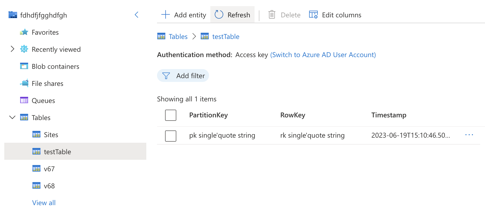
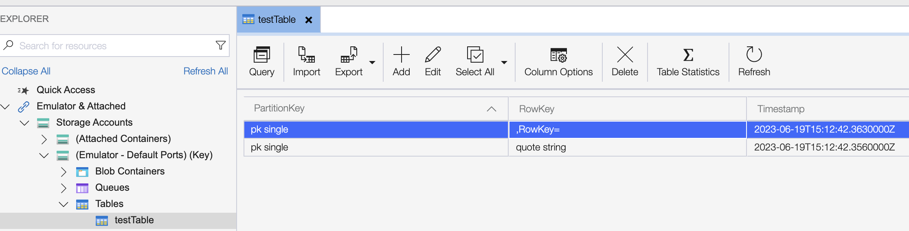

# Azurite bug when escaping single quotes in a string

Azurite v3.19.0 doesn't escape single quotes.

## Steps to reproduce

```sh
make azurite
make run
```

It works as expected with a real Azure Storage account.



VS

Azurite

